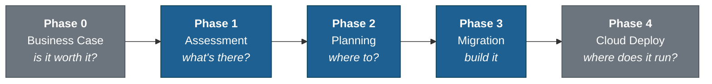

# Legacy Modernization Playbook

**Modernizing legacy systems with GitHub Copilot.** Multi-technology template with Copilot agents covering the full cycle: assessment, planning, migration execution, and target cloud architecture on Azure.

Built from real migrations in banking, government, and telco in LATAM.

> Currently with complete coverage for **Visual Basic 6 / VB.NET**, **.NET Framework 2.0-4.8**, and **Java legacy (J2EE, Spring 3/4, Oracle Forms)**. Designed to extend to COBOL, Python, and other technologies without breaking the methodology.
>
> **Versión en español:** [README.md](README.md)

---

## Real case

Migration of a VB6 HR management system (attendance control, payroll history, vacations, paperwork) to WPF + .NET 8 following the playbook:

| Metric | Result |
| --- | --- |
| Features migrated | 15 / 15 |
| Tests | **146 / 146 passed** (78 Domain + 24 Application + 44 Parity) |
| Final build | **0 errors, 0 warnings** across the entire solution |
| Documented ADRs | 9 (target stack, OCX replacement, ORM, MVVM, etc.) |
| Integrations deferred with ADR | SigPlusNET, WebView2, QuestPDF |
| Architecture layers | Clean Architecture (Domain + Application + Infrastructure + WPF) |

The client can audit every decision, every migrated feature, and every test executed.

---

## Five-phase methodology



**Phases 1, 2, and 3 are required** (assessment → planning → migration). Phase 0 and Phase 4 are optional but recommended for real client projects.

| Phase | Question | Agent | Deliverable |
| --- | --- | --- | --- |
| 0. Business Case _(optional)_ | Is it worth it? | `@business-case-analyst` | TCO, ROI, risk, executive summary |
| 0. Security _(optional)_ | What are the risks? | `@security-assessor` | Whitehat / pentest report of the legacy |
| **1. Assessment** | What does the legacy contain? | `@<tech>-assessment` | `docs/features/` + `docs/dependency-graph.md` |
| **2. Planning** | What stack and why? | `@<tech>-planning` | `docs/ARQUITECTURA-TARGET.md` + `docs/adr/` |
| **3. Migration** | How to build it? | `@<tech>-migration` | `src/` with parity + tests + `migration-log.md` |
| 4. Cloud Deploy _(optional)_ | Where does it run? | `@azure-architect` | `cloud-architectures/azure/` with IaC + pricing |

Full methodology in [`docs/methodology/00-overview.md`](docs/methodology/00-overview.md).

---

## End-to-end example: migrating a VB6 system to WPF + .NET 8

This is the real flow that produced the case study above. All agents are invoked from GitHub Copilot Chat in VS Code.

### Step 1: Clone and bootstrap

```bash
git clone https://github.com/armandoblanco/legacy-modernization-playbook.git my-project
cd my-project
rm -rf .git && git init

./bootstrap.sh      # Linux/macOS/WSL
.\bootstrap.ps1     # Windows
```

The bootstrap asks for project name, client, legacy technology, and target stack. It adapts the repo, copies the right agents to `.github/agents/`, and generates `.copilot-project.yml`.

### Step 2: Load the legacy code

```bash
mkdir -p legacy/
cp -r /path/to/vb6-code/* legacy/
```

Code in `legacy/` is read-only. Agents read it but never modify it.

### Step 3: Phase 1: Assessment

In GitHub Copilot Chat:

```text
@vb-assessment Analyze the system in legacy/
```

The agent reads the code, detects dependencies, classifies OCX/COM, extracts business rules, and produces:

```
docs/
├── README.md                          Master index of the assessment
├── SUMMARY.md                         Executive summary for client review
├── dependency-graph.md                Mermaid graph + topological migration order
└── features/
    ├── 01-authentication-and-access.md
    ├── 02-personal-data.md
    ├── 03-attendance-history.md
    ├── 04-incidents-management.md
    ├── 05-vacations-management.md
    └── ...                            (one .md per detected functional feature)
```

Each feature contains: functional description, technical components (forms, modules, classes), business rules extracted with `file:line` citation, external dependencies, migration blockers, and size estimation.

### Step 4: Phase 2: Planning

```text
@vb-planning Review the assessment and plan the migration
```

The agent reads Phase 1 outputs, asks the user critical decisions (target stack, replacement for blocking OCX, ORM strategy, MVVM framework, architecture pattern), and produces:

```
docs/
├── ARQUITECTURA-TARGET.md             Target stack + legacy → modern mapping
├── migration-plan.md                  Migration order with dependencies
└── adr/
    ├── ADR-001-target-stack.md                  WPF .NET 8 + CommunityToolkit.Mvvm
    ├── ADR-002-sigplusnet-replacement.md        InkCanvas + SigPlusNET
    ├── ADR-003-acropdf-replacement.md           Microsoft WebView2
    ├── ADR-004-excel-interop-replacement.md     ClosedXML + QuestPDF
    ├── ADR-005-outlook-interop-replacement.md   MailKit via SMTP
    ├── ADR-006-patron-arquitectonico.md         Clean Architecture 4 layers
    ├── ADR-007-orm-bd-strategy.md               EF Core + Dapper hybrid
    ├── ADR-008-mvvm-framework.md                CommunityToolkit.Mvvm 8
    └── ADR-009-navegacion-wpf.md                Dynamic TabControl
```

Each ADR has context, decision, alternatives considered, consequences, and mitigations. It's the contract Phase 3 will respect.

### Step 5: Phase 3: Migration

```text
@vb-migration Execute the migration of the legacy system
```

The agent reads `ARQUITECTURA-TARGET.md` + ADRs, follows the topological order of the plan, and generates modern code in `src/` with embedded tests:

```
src/
├── MyProject.sln
├── MyProject.Domain/                  Entities, Value Objects, Domain Services
├── MyProject.Application/             Use Cases, orchestrating Services
├── MyProject.Infrastructure/          EF Core + Dapper Repositories, External APIs
├── MyProject.Wpf/                     Views + ViewModels (MVVM)
└── MyProject.Tests/
    ├── DomainTests/
    ├── ApplicationTests/
    └── ParityTests/                   Validate functional parity with the legacy
```

It works feature by feature with compile-and-test between layers, never accumulating changes. Documents each decision in `migration/migration-log.md` and reports "Done" tables verified per feature.

### Step 6: Phase 4 (optional): Cloud architecture on Azure

```text
@azure-architect Design the cloud architecture for MyProject on Azure
```

Produces Mermaid diagram, cloud ADRs, and pricing validated via Azure Retail Prices API in `cloud-architectures/azure/`.

---

## Other technologies

The same flow applies to .NET Framework and Java legacy with their specific agents.

### .NET Framework 2.0-4.8

```text
@dotnet-assessment Analyze the system in legacy/
@dotnet-planning Review the assessment and plan the migration
@dotnet-migration Execute the migration of the legacy system
```

Full guide: [`docs/QUICKSTART-dotnet.md`](docs/QUICKSTART-dotnet.md)

### Java legacy (J2EE, Spring 3/4, Oracle Forms)

The bootstrap asks for the Java sub-stack. Depending on the choice, the agents are:

| Sub-stack | When it applies | Agents |
| --- | --- | --- |
| **J2EE** | EJB 2.x/3.x, JSP, WebLogic/WebSphere | `@j2ee-assessment` · `@j2ee-planning` · `@j2ee-migration` |
| **Spring legacy** | Spring 3.x/4.x, Struts, Java 6/7/8 | `@spring-legacy-assessment` · `@spring-legacy-planning` · `@spring-legacy-migration` |
| **Oracle Forms** | Forms 11g/12c, embedded PL/SQL | `@oracle-forms-assessment` · `@oracle-forms-planning` · `@oracle-forms-migration` |

Spring legacy example:

```text
@spring-legacy-assessment Analyze the system in legacy/
@spring-legacy-planning Review the assessment and plan the migration to Spring Boot 3
@spring-legacy-migration Execute the migration of the legacy system
```

Full guide: [`docs/QUICKSTART-java.md`](docs/QUICKSTART-java.md)

---

## Supported technologies

| Technology | Status | Quickstart |
| --- | --- | --- |
| **Visual Basic** (VB6 + VB.NET legacy) | Complete and validated in production | Example in this README |
| **.NET Framework 2.0-4.8** | Complete | [`docs/QUICKSTART-dotnet.md`](docs/QUICKSTART-dotnet.md) |
| **Java legacy** (3 sub-stacks) | Complete | [`docs/QUICKSTART-java.md`](docs/QUICKSTART-java.md) |
| **COBOL** (z/OS, distributed) | Placeholder | [`docs/technologies/cobol/`](docs/technologies/cobol/) |
| **Python 2 / 3 old** | Placeholder | [`docs/technologies/python/`](docs/technologies/python/) |

To add a new technology, see [`docs/technologies/README.md`](docs/technologies/README.md).

---

## Available Copilot agents

Full list with descriptions and example prompts: [`docs/AGENTS.md`](docs/AGENTS.md)

**Shared (any technology):**
- `@business-case-analyst`: Phase 0 (TCO, ROI, risk, executive)
- `@security-assessor`: Phase 0 (whitehat / pentest of the legacy)
- `@azure-architect`: Phase 4 (Mermaid + pricing validated via Retail Prices API)

**Technology-specific:** see table above.

---

## Additional documentation

- [`docs/AGENTS.md`](docs/AGENTS.md): Complete agent catalog with example prompts
- [`docs/PROJECT-STRUCTURE.md`](docs/PROJECT-STRUCTURE.md): Repo structure folder by folder
- [`docs/PHILOSOPHY.md`](docs/PHILOSOPHY.md): Philosophy, lessons learned, what this template is NOT
- [`docs/methodology/00-overview.md`](docs/methodology/00-overview.md): Detailed 5-phase methodology

---

## Contributing

If you've modernized a system with this methodology and have new lessons or undocumented pitfalls, open an issue or PR. We're especially looking for:

- Real cases of COBOL and Python 2 to populate placeholders
- Business case templates validated with client finance teams
- Technical pitfalls not documented in the per-technology catalogs

## License

MIT: use freely, attribute if you want.
