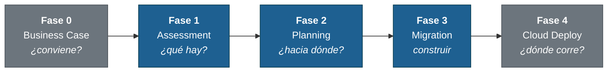

# Legacy Modernization Playbook

**Modernización de sistemas legacy con GitHub Copilot.** Plantilla multi-tecnología con agentes Copilot que cubren el ciclo completo: assessment, planning, ejecución de migración y arquitectura cloud target en Azure.

Construida a partir de migraciones reales en banca, gobierno y telco en LATAM.

> Hoy con cobertura completa para **Visual Basic 6 / VB.NET**, **.NET Framework 2.0-4.8** y **Java legacy (J2EE, Spring 3/4, Oracle Forms)**. Diseñada para extenderse a COBOL, Python y otras tecnologías sin romper la metodología.
>
> **English version:** [README.en.md](README.en.md)

---

## Caso real

Migración de un sistema VB6 de gestión de RRHH (control de asistencia, kárdex, vacaciones, papelería) a WPF + .NET 8 siguiendo el playbook:

| Métrica | Resultado |
| --- | --- |
| Features migrados | 15 / 15 |
| Tests | **146 / 146 passed** (78 Domain + 24 Application + 44 Parity) |
| Build final | **0 errors, 0 warnings** en toda la solución |
| ADRs documentados | 9 (target stack, replacement de OCX, ORM, MVVM, etc.) |
| Integraciones diferidas con ADR | SigPlusNET, WebView2, QuestPDF |
| Capas de arquitectura | Clean Architecture (Domain + Application + Infrastructure + WPF) |

El cliente puede auditar cada decisión, cada feature migrado, y cada test ejecutado.

---

## Metodología en cinco fases



**Fases 1, 2 y 3 son requeridas** (assessment → planning → migration). Fase 0 y Fase 4 son opcionales pero recomendadas en proyectos reales con cliente.

| Fase | Pregunta | Agente | Entregable |
| --- | --- | --- | --- |
| 0. Business Case _(opcional)_ | ¿Vale la pena? | `@business-case-analyst` | TCO, ROI, riesgo, resumen ejecutivo |
| 0. Security _(opcional)_ | ¿Qué riesgos hay? | `@security-assessor` | Reporte whitehat / pentest del legacy |
| **1. Assessment** | ¿Qué tiene el legacy? | `@<tech>-assessment` | `docs/features/` + `docs/dependency-graph.md` |
| **2. Planning** | ¿A qué stack y por qué? | `@<tech>-planning` | `docs/ARQUITECTURA-TARGET.md` + `docs/adr/` |
| **3. Migration** | ¿Cómo construirlo? | `@<tech>-migration` | `src/` con paridad + tests + `migration-log.md` |
| 4. Cloud Deploy _(opcional)_ | ¿Dónde corre? | `@azure-architect` | `cloud-architectures/azure/` con IaC + precios |

Detalle metodológico en [`docs/methodology/00-overview.md`](docs/methodology/00-overview.md).

---

## Ejemplo end-to-end: migrando un sistema VB6 a WPF + .NET 8

Este es el flujo real que produjo el caso de éxito de arriba. Todos los agentes se invocan desde GitHub Copilot Chat en VS Code.

### Paso 1: Clonar y bootstrap

```bash
git clone https://github.com/armandoblanco/legacy-modernization-playbook.git mi-proyecto
cd mi-proyecto
rm -rf .git && git init

./bootstrap.sh      # Linux/macOS/WSL
.\bootstrap.ps1     # Windows
```

El bootstrap pregunta nombre del proyecto, cliente, tecnología legacy y stack target. Adapta el repo, copia los agentes correctos a `.github/agents/` y genera `.copilot-project.yml`.

### Paso 2: Cargar el código legacy

```bash
mkdir -p legacy/
cp -r /ruta/al/codigo-vb6/* legacy/
```

El código en `legacy/` es read-only. Los agentes lo leen pero nunca lo modifican.

### Paso 3: Fase 1: Assessment

En GitHub Copilot Chat:

```text
@vb-assessment Analiza el sistema en legacy/
```

El agente lee el código, detecta dependencias, clasifica OCX/COM, extrae reglas de negocio y produce:

```
docs/
├── README.md                          Índice maestro del assessment
├── SUMMARY.md                         Resumen ejecutivo para revisar con cliente
├── dependency-graph.md                Grafo Mermaid + orden topológico de migración
└── features/
    ├── 01-autenticacion-y-acceso.md
    ├── 02-datos-generales-personal.md
    ├── 03-kardex-asistencia.md
    ├── 04-gestion-incidencias.md
    ├── 05-gestion-vacaciones.md
    └── ...                            (un .md por feature funcional detectado)
```

Cada feature contiene: descripción funcional, componentes técnicos (formularios, módulos, clases), reglas de negocio extraídas con cita a `archivo:línea`, dependencias externas, bloqueos para migración, y estimación de tamaño.

### Paso 4: Fase 2: Planning

```text
@vb-planning Revisa el assessment y planifica la migración
```

El agente lee los outputs de Fase 1, pregunta al usuario las decisiones críticas (stack target, replacement de OCX bloqueantes, estrategia ORM, framework MVVM, patrón de arquitectura), y produce:

```
docs/
├── ARQUITECTURA-TARGET.md             Stack target + mapping legacy → moderno
├── migration-plan.md                  Orden de migración con dependencias
└── adr/
    ├── ADR-001-target-stack.md                  WPF .NET 8 + CommunityToolkit.Mvvm
    ├── ADR-002-sigplusnet-replacement.md        InkCanvas + SigPlusNET
    ├── ADR-003-acropdf-replacement.md           WebView2 de Microsoft
    ├── ADR-004-excel-interop-replacement.md     ClosedXML + QuestPDF
    ├── ADR-005-outlook-interop-replacement.md   MailKit vía SMTP
    ├── ADR-006-patron-arquitectonico.md         Clean Architecture 4 capas
    ├── ADR-007-orm-bd-strategy.md               EF Core + Dapper híbrido
    ├── ADR-008-mvvm-framework.md                CommunityToolkit.Mvvm 8
    └── ADR-009-navegacion-wpf.md                TabControl dinámico
```

Cada ADR tiene contexto, decisión, alternativas consideradas, consecuencias y mitigaciones. Es el contrato que la Fase 3 va a respetar.

### Paso 5: Fase 3: Migration

```text
@vb-migration Ejecuta la migración del sistema legacy
```

El agente lee `ARQUITECTURA-TARGET.md` + ADRs, sigue el orden topológico del plan, y genera código moderno en `src/` con tests embebidos:

```
src/
├── MiProyecto.sln
├── MiProyecto.Domain/                 Entidades, Value Objects, Domain Services
├── MiProyecto.Application/            Use Cases, Services orquestadores
├── MiProyecto.Infrastructure/         Repositories EF Core + Dapper, External APIs
├── MiProyecto.Wpf/                    Views + ViewModels (MVVM)
└── MiProyecto.Tests/
    ├── DomainTests/
    ├── ApplicationTests/
    └── ParityTests/                   Validan paridad funcional con el legacy
```

Trabaja feature por feature con compile-and-test entre capas, no acumula cambios. Documenta cada decisión en `migration/migration-log.md` y reporta tablas de "Done" verificadas por feature.

### Paso 6: Fase 4 (opcional): Arquitectura cloud en Azure

```text
@azure-architect Diseña la arquitectura cloud para MiProyecto en Azure
```

Produce diagrama Mermaid, ADRs cloud, y precios validados vía Azure Retail Prices API en `cloud-architectures/azure/`.

---

## Otras tecnologías

El mismo flujo aplica para .NET Framework y Java legacy con sus agentes específicos.

### .NET Framework 2.0-4.8

```text
@dotnet-assessment Analiza el sistema en legacy/
@dotnet-planning Revisa el assessment y planifica la migración
@dotnet-migration Ejecuta la migración del sistema legacy
```

Guía completa: [`docs/QUICKSTART-dotnet.md`](docs/QUICKSTART-dotnet.md)

### Java legacy (J2EE, Spring 3/4, Oracle Forms)

El bootstrap pregunta el sub-stack Java. Según el elegido, los agentes son:

| Sub-stack | Cuando aplica | Agentes |
| --- | --- | --- |
| **J2EE** | EJB 2.x/3.x, JSP, WebLogic/WebSphere | `@j2ee-assessment` · `@j2ee-planning` · `@j2ee-migration` |
| **Spring legacy** | Spring 3.x/4.x, Struts, Java 6/7/8 | `@spring-legacy-assessment` · `@spring-legacy-planning` · `@spring-legacy-migration` |
| **Oracle Forms** | Forms 11g/12c, PL/SQL embebido | `@oracle-forms-assessment` · `@oracle-forms-planning` · `@oracle-forms-migration` |

Ejemplo Spring legacy:

```text
@spring-legacy-assessment Analiza el sistema en legacy/
@spring-legacy-planning Revisa el assessment y planifica la migración a Spring Boot 3
@spring-legacy-migration Ejecuta la migración del sistema legacy
```

Guía completa: [`docs/QUICKSTART-java.md`](docs/QUICKSTART-java.md)

---

## Tecnologías soportadas

| Tecnología | Estado | Quickstart |
| --- | --- | --- |
| **Visual Basic** (VB6 + VB.NET legacy) | Completo y validado en producción | Ejemplo en este README |
| **.NET Framework 2.0-4.8** | Completo | [`docs/QUICKSTART-dotnet.md`](docs/QUICKSTART-dotnet.md) |
| **Java legacy** (3 sub-stacks) | Completo | [`docs/QUICKSTART-java.md`](docs/QUICKSTART-java.md) |
| **COBOL** (z/OS, distributed) | Placeholder | [`docs/technologies/cobol/`](docs/technologies/cobol/) |
| **Python 2 / 3 antiguo** | Placeholder | [`docs/technologies/python/`](docs/technologies/python/) |

Para añadir una tecnología nueva, ver [`docs/technologies/README.md`](docs/technologies/README.md).

---

## Agentes Copilot disponibles

Lista completa con descripción y prompts de ejemplo: [`docs/AGENTS.md`](docs/AGENTS.md)

**Compartidos (cualquier tecnología):**
- `@business-case-analyst`: Fase 0 (TCO, ROI, riesgo, ejecutivo)
- `@security-assessor`: Fase 0 (whitehat / pentest del legacy)
- `@azure-architect`: Fase 4 (Mermaid + precios validados vía Retail Prices API)

**Específicos por tecnología:** ver tabla de arriba.

---

## Documentación adicional

- [`docs/AGENTS.md`](docs/AGENTS.md): Catálogo completo de agentes con prompts de ejemplo
- [`docs/PROJECT-STRUCTURE.md`](docs/PROJECT-STRUCTURE.md): Estructura del repo carpeta por carpeta
- [`docs/PHILOSOPHY.md`](docs/PHILOSOPHY.md): Filosofía, lecciones aprendidas, qué NO es esta plantilla
- [`docs/methodology/00-overview.md`](docs/methodology/00-overview.md): Metodología detallada de las 5 fases

---

## Contribuir

Si has modernizado un sistema con esta metodología y tienes lecciones nuevas o trampas no documentadas, abre issue o PR. Especialmente buscamos:

- Casos reales de COBOL y Python 2 para poblar placeholders
- Templates de business case validados con áreas financieras de clientes
- Trampas técnicas no documentadas en los catálogos de cada tecnología

## Licencia

MIT: usa libremente, atribuye si quieres.
