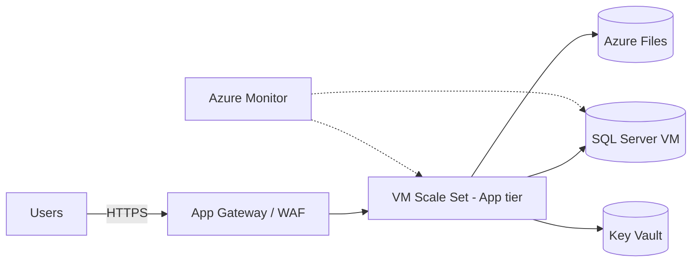

# Patrón: Lift-and-shift (IaaS)

> **Tipo:** Rehost — mínimo cambio de código, máximo costo operativo.

## Cuándo elegir

- Tiempo crítico (deadline regulatorio o cierre de datacenter)
- Sin presupuesto/equipo para refactor en este ciclo
- Aplicación con dependencias específicas de OS/hardware difíciles de PaaS-ificar
- Step intermedio antes de Replatform/Refactor en una segunda fase

## Cuándo NO

- Si el objetivo principal es reducir costos operativos (PaaS o Serverless es mejor)
- Si la app puede correr en App Service / Container Apps sin grandes cambios (ir directo a esos)
- Si el equipo no quiere mantener parches de OS, antivirus, backups manuales

## Componentes típicos en Azure

| Componente | Servicio Azure |
| --- | --- |
| Compute | Virtual Machines + VMSS (si necesita autoscale básico) |
| Red | VNet, NSG, Azure Bastion, Application Gateway / Azure Firewall |
| Storage | Managed Disks (Premium SSD), Azure Files si shares SMB |
| BD | SQL Server en VM (si licencia BYOL), o migrar a Azure SQL |
| Backup | Azure Backup |
| DR | Azure Site Recovery |
| Identidad | Domain Controller en VM o Entra Domain Services |
| Observabilidad | Azure Monitor + Log Analytics + agente VM Insights |
| Secretos | Azure Key Vault |

## Diagrama (placeholder)

## Costo aproximado (orientativo, validar con Pricing Calculator)

| Item | Tamaño ejemplo | Costo mensual aprox (USD) |
| --- | --- | --- |
| 2x VM D4s v5 (app) | 4 vCPU / 16 GB | $300 |
| 1x VM D8s v5 (BD) | 8 vCPU / 32 GB | $400 |
| Managed Disks Premium | 512 GB | $80 |
| App Gateway WAF v2 | 1 instancia | $250 |
| Backup + ASR | | $120 |
| Egress | 100 GB/mes | $10 |
| **Total estimado** | | **~$1,160** |

## IaC sugerido

- Bicep o Terraform
- Imágenes base con Packer o Azure Image Builder
- Configuración con Ansible / DSC / Custom Script Extension

## Riesgos

- Costos crecientes si no se hace rightsizing periódico
- Patches y hardening del OS son responsabilidad del cliente
- No aprovecha elasticidad cloud nativa
- Operaciones similares a on-premise — el equipo puede no ver los beneficios

## Cuándo evolucionar a otro patrón

- Después de estabilizar (3-6 meses), evaluar mover BD a Azure SQL Managed Instance
- Si la app tier es stateless, replatform a App Service o Container Apps
- Si hay módulos batch, mover a Azure Functions / Container Apps Jobs
