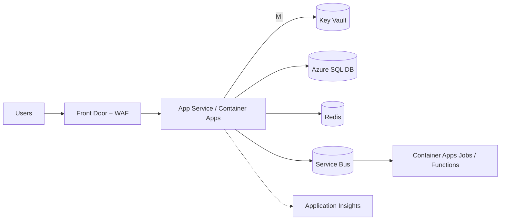

# Patrón: PaaS managed (App Service / Container Apps)

> **Tipo:** Replatform — cambios mínimos, gana managed services.

## Cuándo elegir

- App moderna o modernizada que es stateless o casi stateless
- Equipo pequeño que no quiere operar OS ni Kubernetes
- Picos de tráfico moderados (autoscale horizontal sencillo)
- Web app + API + jobs ligeros — caso muy común post-modernización

## Cuándo NO

- Workloads que requieren GPUs, kernel customizado o compliance extremo
- Necesidad de control fino del runtime (sidecars complejos, service mesh)
- Costos predecibles muy altos donde una reserva de VM es más barata

## Componentes típicos en Azure

| Componente | Servicio Azure |
| --- | --- |
| App web / API .NET | Azure App Service (Linux) o Azure Container Apps |
| Jobs / batch | Container Apps Jobs o Azure Functions |
| BD | Azure SQL Database / PostgreSQL Flexible Server / MySQL Flexible |
| Cache | Azure Cache for Redis |
| Storage | Azure Blob Storage / Azure Files |
| Mensajería | Azure Service Bus / Storage Queues |
| Identidad | Microsoft Entra ID (managed identities, OIDC) |
| Observabilidad | Application Insights + Log Analytics |
| Secretos | Azure Key Vault con Managed Identity |
| CDN / WAF | Azure Front Door (Standard/Premium) |
| CI/CD | GitHub Actions o Azure DevOps |

## Diagrama

## Costo aproximado (orientativo)

| Item | Tier ejemplo | Costo mensual aprox (USD) |
| --- | --- | --- |
| App Service P1v3 x2 | | $250 |
| Azure SQL DB GP_S_Gen5_2 | 2 vCore | $200 |
| Redis Standard C1 | | $90 |
| Front Door Standard | | $35 + tráfico |
| App Insights | 5 GB/mes ingest | $15 |
| Service Bus Standard | | $10 + ops |
| **Total estimado** | | **~$600** |

## IaC sugerido

- **Azure Verified Modules** (Bicep) — `mcp_bicep_get_bicep_best_practices` antes de generar
- Terraform `azurerm` provider
- `azd` (Azure Developer CLI) si el repo del cliente usa azure.yaml

## Riesgos

- Cold starts en Consumption / Functions plan (mitigar con Premium o Always Ready)
- Límites de plan (CPU, memoria, conexiones SNAT) — monitorear y planear scale-up
- Lock-in moderado a APIs Azure (parametrizar con abstractions)

## Anti-patrón

> "Voy a meter una VM en App Service" — App Service no es VM, no abrir RDP/SSH ni asumir filesystem persistente.

## Evolucionar a

- **Microservicios event-driven** si la lógica se descompone naturalmente (ver `05-microservices-event-driven.md`)
- **AKS** solo si los límites de Container Apps no alcanzan o se necesita control fino
