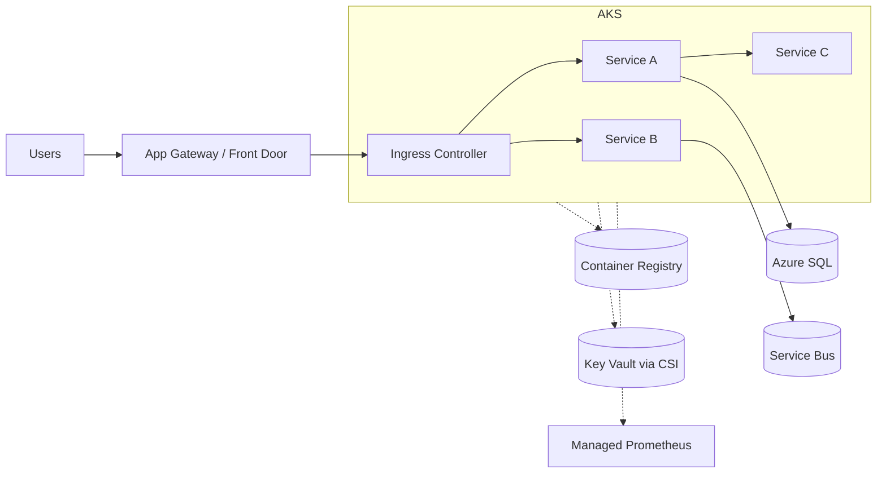

# Patrón: Containers + Kubernetes (AKS)

> **Tipo:** Refactor a contenedores con orquestación. Control total, complejidad alta.

## Cuándo elegir

- Múltiples servicios con dependencias y patrones de despliegue complejos
- Necesidad de portabilidad entre nubes / on-prem
- Equipo con experiencia operando Kubernetes
- Requisitos de service mesh, autoscale por métricas custom, GitOps, multi-tenancy
- Workloads que se benefician de empaquetado uniforme (Helm charts, OCI artifacts)

## Cuándo NO

- App monolítica única — Container Apps o App Service son MUCHO más baratos
- Equipo de <5 personas operando — el overhead de K8s es alto
- "Porque está de moda" — anti-patrón clásico, mata el ROI

## Componentes típicos en Azure

| Componente | Servicio Azure |
| --- | --- |
| Orquestador | AKS (Automatic SKU para empezar, Standard SKU para tuning fino) |
| Registro | Azure Container Registry (Premium con replicación regional) |
| Networking | Azure CNI Overlay, Private API Server, Azure Firewall egreso |
| Ingress | NGINX Ingress / Application Gateway Ingress Controller / Istio |
| Service mesh | Open Service Mesh (deprecado), Istio addon, Linkerd self-managed |
| Secretos | CSI Secrets Store + Key Vault Provider |
| Identidad | Workload Identity (federada con Entra) |
| Observabilidad | Container Insights + Managed Prometheus + Managed Grafana |
| Storage | Azure Disks CSI / Azure Files CSI / Blob CSI |
| BD | Externa al cluster (Azure SQL, PostgreSQL Flexible) |
| GitOps | ArgoCD o Flux (extensión nativa AKS) |
| Costos | KEDA + cluster autoscaler + spot nodepools + cost analysis addon |

## Diagrama

## Costo aproximado

| Item | Tamaño ejemplo | Costo mensual aprox (USD) |
| --- | --- | --- |
| AKS control plane (Free) | | $0 |
| 3x Standard_D4s_v5 nodes | system + user | $400 |
| Spot pool 2x | bursty workloads | $80 |
| ACR Premium | | $50 |
| App Gateway WAF | | $250 |
| Container Insights | | $50 + ingest |
| Managed Prometheus + Grafana | | $50 |
| **Total estimado** | | **~$880** + servicios externos |

> El costo crece rápido; usar reserved instances + spot + cluster autoscaler agresivo.

## IaC sugerido

- Bicep o Terraform para infra del cluster
- Helm + Kustomize para workloads, gestionados con ArgoCD/Flux
- Pipelines: GitHub Actions con OIDC a Azure (sin secretos)

## Riesgos

- Curva de operación alta — entrenar al equipo o subcontratar managed services
- Costos descontrolados sin FinOps — habilitar AKS Cost Analysis addon desde día 1
- Versionado de K8s requiere upgrades cada ~4 meses
- Seguridad: pod security, network policies, image scanning (Defender for Containers)

## Cuándo es realmente la respuesta correcta

- 10+ servicios, equipo plataforma dedicado, requisitos de portabilidad o multi-cloud reales, escala alta sostenida
- Para todo lo demás, **Container Apps** es la respuesta correcta y más barata
