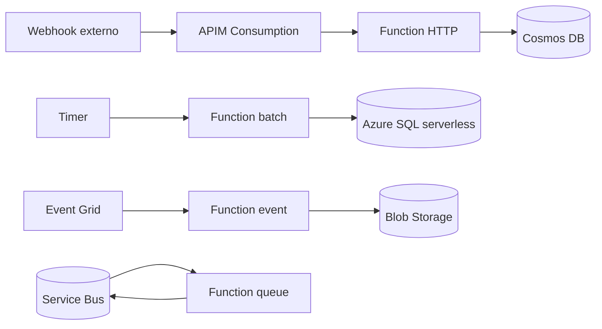

# Patrón: Serverless / FaaS (Azure Functions)

> **Tipo:** Refactor profundo a funciones event-driven. Pago por ejecución.

## Cuándo elegir

- Workloads **event-driven** o **periódicos** (timer triggers, queue processors, webhooks)
- Tráfico muy variable o muy bajo (pagar solo por lo usado)
- Pequeñas APIs HTTP que no justifican un App Service permanente
- Procesamiento batch ligero / ETL
- Glue entre servicios (event grid → function → service bus)

## Cuándo NO

- Tráfico alto y sostenido — App Service es más barato a partir de cierto volumen
- Procesos largos (>10 min en Consumption, mitigable con Premium hasta 60 min, o Container Apps Jobs)
- Aplicaciones con estado en memoria persistente
- Cold start es inaceptable (usar Premium o Always Ready instances)

## Componentes típicos en Azure

| Componente | Servicio Azure |
| --- | --- |
| Functions | Azure Functions Flex Consumption (preferido) o Premium |
| Triggers | HTTP, Timer, Queue, Service Bus, Event Hub, Event Grid, Blob, Cosmos |
| Identidad | Managed Identity para acceder a recursos |
| Secretos | Key Vault references |
| BD | Cosmos DB (serverless) o Azure SQL (serverless) |
| Storage | Blob Storage |
| Eventos | Event Grid (routing), Event Hubs (streaming), Service Bus (mensajería) |
| API mgmt | Azure API Management (Consumption tier para serverless) |
| Observabilidad | Application Insights nativo |

## Diagrama

## Costo aproximado (orientativo)

| Item | Volumen ejemplo | Costo mensual aprox (USD) |
| --- | --- | --- |
| Functions Flex Consumption | 5M ejecuciones, 400k GB-s | ~$25 |
| Cosmos DB serverless | 5M RUs | ~$10 |
| Service Bus Standard | | $10 |
| Application Insights | 5 GB | $15 |
| Storage account | | $5 |
| **Total estimado** | | **~$65** (puede crecer 10x con tráfico) |

> Serverless es muy barato a baja escala y caro a alta escala — modelar antes de elegir.

## IaC sugerido

- Bicep + AVM modules
- `azd` con plantilla `func-serverless`
- Configurar `host.json` para timeouts, retries, batch sizes

## Riesgos

- **Cold starts** (mitigar con Premium plan o pre-warmed instances)
- Time-out por defecto 5 min en Consumption (10 max), 60 min en Premium
- Límite de payload HTTP 100 MB
- Lock-in a triggers de Azure (mitigable con Functions extensions)
- Debug local requiere Azure Functions Core Tools

## Anti-patrones

- "Serverless para todo" — un monolito troceado en 200 funciones es peor que un monolito
- Funciones que hablan entre sí por HTTP síncrono — usar Service Bus o orchestration (Durable Functions)
- Logs solo en Function output sin App Insights configurado

## Variantes

- **Durable Functions** para orquestaciones de larga duración (sagas, workflows con humanos)
- **Logic Apps** para integraciones bajo-código (mejor que Functions para flujos visuales con muchos conectores)
