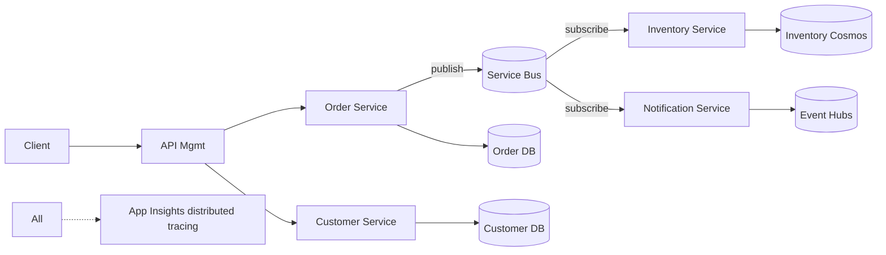

# Patrón: Microservicios event-driven

> **Tipo:** Refactor profundo. Escala extrema. Complejidad organizacional alta.

## Cuándo elegir

- Múltiples bounded contexts claramente identificados (DDD)
- Equipo grande organizado por dominio (Conway's Law: estructura sigue equipos)
- Necesidad de desplegar partes del sistema independientemente
- Cargas asimétricas: distintas partes escalan a velocidades muy diferentes
- Resiliencia crítica: aislamiento de fallos por dominio

## Cuándo NO

- App pequeña-mediana con un solo equipo — distributed monolith garantizado
- Sin DDD claro — los servicios serán acoplados de forma artificial
- Sin observabilidad madura — distributed tracing es obligatorio
- Sin pipeline de despliegue independiente por servicio
- Sin equipo plataforma para mantener mensajería, registros, eventos

## Componentes típicos en Azure

| Componente | Servicio Azure |
| --- | --- |
| Hosting servicios | Container Apps (preferido) o AKS si requiere control |
| Mensajería | Service Bus (queues + topics) y/o Event Grid (routing) |
| Streaming | Event Hubs (alto volumen) o Kafka on HDInsight / Confluent |
| API Gateway | Azure API Management o Application Gateway / Front Door |
| Service-to-service | gRPC, HTTP/2, async messaging preferido |
| Identidad | Entra ID + Managed Identity + OAuth/OIDC |
| BD | Una BD por servicio (poliglota): SQL, Cosmos, PostgreSQL |
| Cache | Redis compartido o por servicio |
| Observabilidad | App Insights con distributed tracing (W3C Trace Context), OpenTelemetry |
| Saga / orchestration | Durable Functions o Camunda / Temporal |
| Schema registry | Apicurio / Confluent Schema Registry |
| Service mesh (opcional) | Istio / Linkerd si se elige AKS |

## Diagrama

## Costo aproximado

Costo crece linealmente con número de servicios + mensajería + storage. Plantilla mínima:

| Item | Volumen ejemplo | Costo mensual aprox (USD) |
| --- | --- | --- |
| Container Apps environment | 5 servicios, 2 réplicas c/u | $300 |
| Service Bus Standard | 1M msgs/día | $50 |
| Event Hubs Standard | 1 TU | $25 |
| 5 BDs (mix) | | $400-600 |
| APIM Developer | (Standard en prod: $700+) | $50 |
| App Insights | 20 GB | $60 |
| **Total estimado** | | **~$900-1,200** mínimo |

## IaC sugerido

- Bicep o Terraform por servicio + módulo compartido de plataforma
- Helm charts si se va por AKS
- Pipeline por servicio + pipeline de plataforma compartida
- Backstage / catalog para descubrir servicios

## Riesgos críticos

- **Distributed monolith**: servicios que se llaman síncronamente en cadena — peor que monolito
- **Datos en duplicado / consistencia eventual** mal entendida — diseñar con saga / outbox
- **Versionado de eventos**: schema evolution con compatibility (backward/forward)
- **Trazas distribuidas**: sin OTel correlation, debug es imposible
- **Costo operativo organizacional**: requiere SRE, plataforma, governance, incident response madura

## Patrones obligatorios

- **Outbox pattern** para publicación transaccional de eventos
- **Saga pattern** (orquestada o coreografiada) para transacciones distribuidas
- **Circuit breaker / retry / timeout** (Polly en .NET, Resilience4j en Java)
- **Idempotency keys** en endpoints y consumers
- **Correlation IDs** end-to-end
- **Event versioning** explícito

## Anti-patrón clásico

> "Vamos a microservicios desde el día 1 porque es el estándar moderno."

Microservicios son una respuesta a un problema **organizacional** (equipos grandes, despliegue independiente). Si no tienes ese problema, son una solución cara que crea problemas que no tenías.

**Camino recomendado:** monolito modular bien diseñado en Container Apps → extraer servicios cuando duela.
